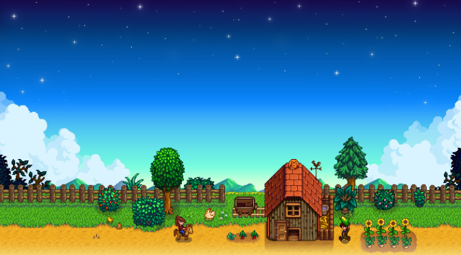

# Functioning prototype
##1.Interaction Description
This work is an automatically running pixel-style animation. Once the page is loaded, no interaction is required—the animation will gradually present the sky’s transformation over the course of a full day within 60 seconds. It includes morning sunlight with blue skies and white clouds, the warm glow of sunset in the evening, and a starry night with the moon. In this project, the sun and moon move slowly across the sky as time passes, while stars twinkle during the night. All visual elements are rendered in a pixelated style, creating a nostalgic yet vivid aesthetic. Users are invited to quietly observe the changing scene and experience the passage of time.
##2.Detailed Information
I chose to use time as the driving force behind my code. This project presents a pixelated scene of day and night transitions, where the animation is driven by time to reflect macro-level natural phenomena. The background color of the sky gradually shifts between dawn, daytime, dusk, and night based on the current time, forming a natural day-night cycle. The sun and moon simulate their rising, movement, and setting across the sky, creating a realistic celestial motion that adds visual interest and rhythm to the scene.
Compared to other works in my group, my animation does not rely on user interaction or small-scale movements. Instead, time is the sole driver, emphasizing the dynamic changes of large-scale natural processes and highlighting the rhythm and continuity of natural laws. This non-interactive narrative approach enhances the overall coherence and immersiveness of the scene, allowing the viewer to experience a continuously looping pixel world with a unique artistic charm and visual storytelling.
My inspiration comes from the day-night transitions in Stardew Valley, where the passage of time is conveyed through subtle color changes and environmental details. I aimed to bring a similar time-based visual transformation into my project, focusing on rhythm and atmosphere to evoke a sense of natural flow and emotional resonance.

##3.Technical explanation
This animation creates a pixel-style day-night cycle background that runs automatically on a 60-second loop. It is a time-driven animation that uses millis() to calculate a normalized time value t (ranging from 0 to 1). The millis() function returns the number of milliseconds since the program started. By taking millis() % 60000 and dividing it by 60000, we normalize time t to a value between 0 and 1. This t acts as a progress marker for the entire day, from sunrise to nightfall.
The gradient portion of the background is dynamically generated using lerpColor(), which produces a smooth gradient effect that moves vertically across the sky. This creates more natural color transitions between different times of the day. The movement of the sun and moon is animated using map(), along with trigonometric functions sin() and cos(), to simulate their smooth, curved paths across the sky. At night, stars are placed randomly using randomSeed(), generating unpredictable star positions for a more natural and scattered night sky.
References:
[Link Text](https://p5js.org/reference/p5/millis/)
[Link Text](https://p5js.org/reference/p5/lerpColor/)
[Link Text](https://p5js.org/reference/p5/randomSeed/)
[Link Text](https://p5js.org/reference/p5/map/)
[Link Text](https://p5js.org/reference/p5/sin/)
[Link Text](https://p5js.org/reference/p5/cos/)
